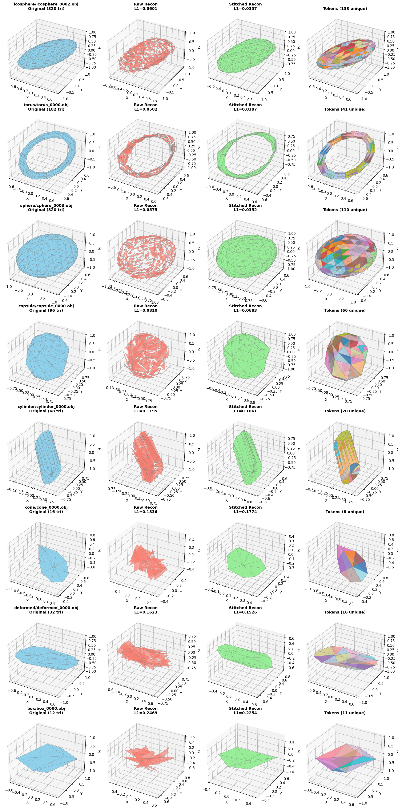

# VQ-VAE for 3D Meshes (MeshGPT-style)

A from-scratch reimplementation of the Vector Quantized Variational Autoencoder (VQ-VAE) used in [MeshGPT](https://nihalsid.github.io/mesh-gpt/) for tokenizing 3D triangle meshes.

## Architecture

```
.obj mesh
    │
    ▼
┌──────────────┐
│  Triangle     │   Each triangle → node, shared edges → graph connections
│  Graph Builder│
└──────┬───────┘
       │  PyG Data (node features = 9D coords, edge_index)
       ▼
┌──────────────┐
│  Encoder      │   4 × SAGEConv layers
│  (GNN)        │   9D → 64 → 128 → 256 → 256
└──────┬───────┘
       │  z_e ∈ ℝ^(N_triangles × 256)
       ▼
┌──────────────┐
│  Vector       │   Codebook of 512 vectors (dim=256)
│  Quantizer    │   Straight-through estimator + commitment loss
└──────┬───────┘
       │  z_q ∈ ℝ^(N_triangles × 256)
       ▼
┌──────────────┐
│  Decoder      │   MLP: 256 → 256 → 128 → 9
│  (MLP)        │   Reconstructs 3 vertex coords per triangle
└──────────────┘
       │
       ▼
  Reconstructed triangle coordinates
```

## Project Structure

```
vq-vae/
├── README.md
├── requirements.txt
├── .gitignore
├── mesh_dataset.py      # ShapeNet .obj loading + triangle graph construction
├── encoder.py           # 4-layer SAGEConv GNN encoder
├── vector_quantizer.py  # Vector Quantization with EMA updates
├── decoder.py           # MLP decoder for coordinate reconstruction
├── model.py             # Full VQ-VAE model
├── train.py             # Training loop
└── evaluate.py          # Evaluation and mesh visualization
```

## Setup

```bash
pip install -r requirements.txt
```

## Data

Place ShapeNet `.obj` files under `data/shapenet/`. The dataset loader expects directories of `.obj` files organized by category.

```bash
mkdir -p data/shapenet
# Copy or symlink your .obj files here
```

## Training

```bash
python train.py --data_dir data/shapenet --epochs 100 --batch_size 8 --lr 3e-4
```

## Evaluation

```bash
python evaluate.py --checkpoint checkpoints/best_model.pth --data_dir data/shapenet
```

## Key Design Decisions

- **Graph construction**: Each triangle is a node. Two triangles sharing an edge are connected. Node features are the 9 flattened vertex coordinates (3 vertices × 3 coords).
- **Encoder**: GraphSAGE convolutions propagate information across neighboring triangles, building a contextual embedding per triangle.
- **VQ**: Standard VQ with EMA codebook updates and commitment loss (beta=0.25). Codebook size 512, dimension 256.
- **Decoder**: Simple MLP since we decode per-triangle independently (the graph structure is already captured in the quantized embeddings).

## Results

Trained on 425 low-poly meshes across 8 categories for 300 epochs
(30 epoch autoencoder warmup + 270 epoch VQ phase).



Stitched reconstruction L1 per category (20 meshes each, mean over all categories = **0.099**):

| Category   | Stitched L1 |
|------------|------------:|
| icosphere  |       0.034 |
| torus      |       0.036 |
| sphere     |       0.052 |
| capsule    |       0.082 |
| cylinder   |       0.100 |
| cone       |       0.127 |
| deformed   |       0.146 |
| box        |       0.218 |
| **Mean**   |   **0.099** |

Shapes with repetitive local geometry (torus, icosphere, sphere) compress
well and reconstruct with very low error. Irregular low-poly meshes with
no motif repetition (boxes) are the hardest case.

See [RESULTS.md](RESULTS.md) for the full breakdown including raw L1 and
token-reuse statistics.

## References

- [MeshGPT: Generating Triangle Meshes with Decoder-Only Transformers](https://nihalsid.github.io/mesh-gpt/)
- [Neural Discrete Representation Learning (VQ-VAE)](https://arxiv.org/abs/1711.00937)
- [MeshAnything V2](https://arxiv.org/abs/2408.02555)
